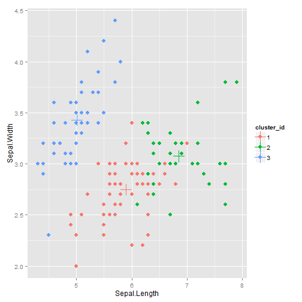

Clustering Iris Dataset
========================================================
author: B. H.
date:

Introduction
========================================================

- Illustrate the use of Kmeans to predict species
- The user can select the number of clusters and the algorithm used in Kmeans
- The user can select which features to view in the clustering plot
- Three different validation metrics are used to show how the quality of clustering changes as the user is changing settings

Clustering Plot
========================================================

- A 2-D plot where the x-axis and y-axis are controlled by the user
- Points are colored by cluster ID
- Centroids are shown using + sign
- A sample output using 3 clusters and Lloyd algorithm is shown below

 

Validation Metrics
========================================================
- Rand Index: Given clustering output Y and acutal class IDs X
- Rand = a + b / (a+b+c+d) where:
  - a: Number of elements in the same set in X and same set in Y
  - b: Number of elements in a different set in X and a different set in Y
  - c: Number of elements in the same set in X and a different set in Y
  - b: Number of elements in a different set in X and same set in Y
- R-Index ranges in [0-1], where higher value means better accuracy

Validation Metrics Continue
========================================================

- Silhouette Index: The average silhouette width for each data point
- For a point i, the silhouette width is given by: $$ s(i) = \frac{b(i)-a(i)}{max{a(i),b(i)}}$$
 - where:
  - a(i): the average distance of i from all points in the same cluster
  - b(i): the lowest average distance of i from all other clusters
- Seperation Index: the mean of the smallest distance of every point to the its closest point
